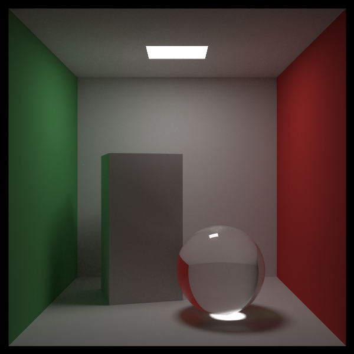
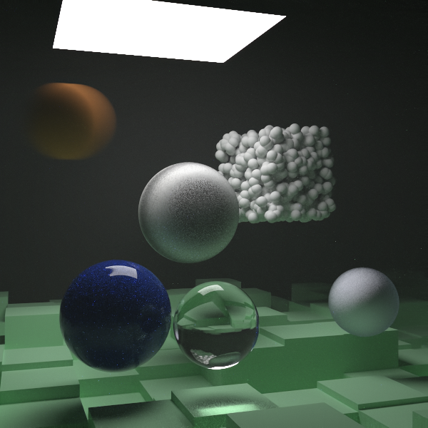

# Kyoubic Relit

## Sample renders




Disclaimer: both images have been processed slightly after rendering (converted
from PPM to PNG, plus some very light denoising).
They are not 100% raw unmodified `./raytracer` output.

A CPU path tracer, adapted from Peter Shirley's "Ray Tracing in One Weekend"
book series into a lightmap baker: renders triangle-soup OBJ meshes (no
spheres/quads-only scene, unlike the books) and writes per-vertex irradiance
instead of a pixel image, for use as Kyoubic's static lightmap bake
backend (see `tools/raytracer_weekend_bake.py` in the parent repo).

## Credit

The core ray tracing algorithms (vec3/ray math, BVH, materials, importance
sampling / PDFs / MIS, constant medium, Perlin noise) are kinda copied from

- *Ray Tracing in One Weekend*
- *Ray Tracing: The Next Week*
- *Ray Tracing: The Rest of Your Life*

by Peter Shirley, Trevor David Black, and Steve Hollasch.
https://raytracing.github.io/

The code, while be it based off the books, has been cleaned up and reformatted.
It is still comparable, just, different. `triangle.hpp`, `obj.{cpp,hpp}`,
and the lightmap-baking mode in `bake.cpp`, however, are NOT from in any of the books.
I wrote those using the books code as a sort of lib to interface with `hittable` and `material`
(`obj.{cpp,hpp}` are ported near-verbatim from Kyoubic but with minor tweaks to remove GLM dep).
`main.cpp` is MOSTLY from the books too (`cornell_box()`, `final_scene()`) but also has
`add_box_light()` and `vulkanproject_scene()` bolted on from OUTSIDE the book.
Those load the real Kyoubic scene geometry and box-lights, as a sanity
check render against the per-vertex bake. Everything else stays 1:1 with
the books so its still comparable if you go read them yourself (which u should, theyre PEAK)

## Building

### Requirements

- CMake 3.15+, OR Python 3 with SCons (`pip install scons`)
- A C++17 compiler. MSVC/`cl` is the default on Windows, override with `cxx=`
  (SCons) or `-DCMAKE_CXX_COMPILER=` (CMake) if you want `clang-cl`, GCC (God forbid),
  whatever.

### Build (SCons)

```
python -m SCons
```

or if u dont have MSC cl.exe and use clang instead

```
python -m SCons cxx=clang-cl
```

### Build (CMake)

```
cmake -B build
cmake --build build
```

if u dont have MSC cl.exe/wanna use clang instead

```
cmake -B build -DCMAKE_CXX_COMPILER=clang-cl
```

Both produce two executables in `build/[subfolder]`, where subfolder depends on
your configurations and build system.

Kyoubic-Relit itself doesnt have a debug/release split.
`/O2`/`-O2` is always on, theres no config to pick here.

The parent Kyoubic engine repo DOES have a real debug/release split tho.
see that repo's own README for how to build it in release mode.

`raytracer` is the books own standalone demo renderer (writes a PPM image)
`bake` is the lightmap baker Kyoubic uses

`tools/raytracer_weekend_bake.py` in the parent Kyoubic repo expects
`bake.exe` (or `bake` on non-Windows) to end up at `tools/Kyoubic-Relit/bake[.exe]`
relative to the tools folder. IMPORTANT: copy or symlink the built binary there
after building, or point `BAKE_EXE` in that script at wherever your build put it.

## Usage as a standalone renderer

```
./build/raytracer > out.ppm
```

Renders whatever scene is hardcoded in `main.cpp` (see the books for how to
swap scenes) to a PPM image on stdout.

## Usage as a lightmap baker

You cant run ts directly (unless u use dark magic). Instead you should use
`tools/raytracer_weekend_bake.py` in the parent repo, which builds the
occluder/light-box argument list from a Kyoubic scene JSON and calls
`bake.exe` with them. See the scripts docstring for the exact CLI it expects
(iirc should be in the first or second comment in each file in `Kyoubic/tools/*.py`)
